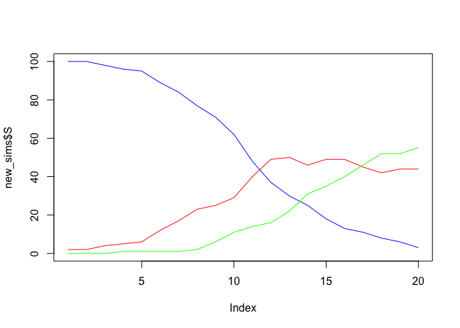

<!-- README.md is generated from README.Rmd. Please edit that file -->

# sirtensor

<!-- badges: start -->
<!-- badges: end -->

The goal of sirtensor is to harness tensorflow for SIR modelling

## Installation

Install the development version from [GitHub](https://github.com/) with:

``` r
# install.packages("devtools")
devtools::install_github("njtierney/sirtensor")
```

## Example

This is a basic example

``` r
set.seed(2021-07-29-1333)
library(sirtensor)
new_sims <- pop_sim()
new_sims
#> # A tibble: 20 x 3
#>        S     I     R
#>    <int> <int> <int>
#>  1   100     2     0
#>  2   100     2     0
#>  3    98     4     0
#>  4    96     5     1
#>  5    95     6     1
#>  6    89    12     1
#>  7    84    17     1
#>  8    77    23     2
#>  9    71    25     6
#> 10    62    29    11
#> 11    48    40    14
#> 12    37    49    16
#> 13    30    50    22
#> 14    25    46    31
#> 15    18    49    35
#> 16    13    49    40
#> 17    11    45    46
#> 18     8    42    52
#> 19     6    44    52
#> 20     3    44    55

plot(new_sims$S, type = "l", col = "blue", ylim = c(0, new_sims$S[1]))
lines(new_sims$I, col = "red")
lines(new_sims$R, col = "green")
```


